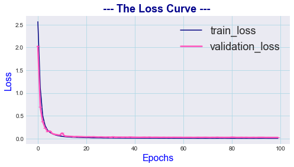
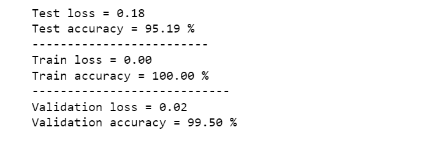
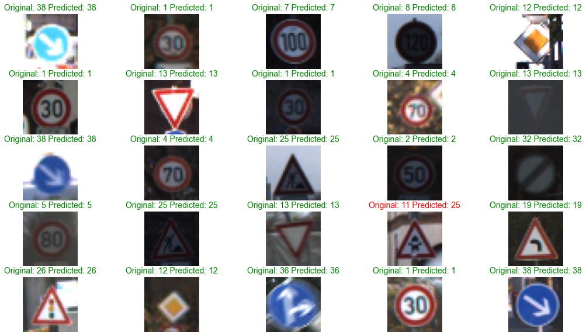

# German_Traffic_sign
# Project: Build a Traffic Sign Recognition Program

# Overview
In this project, you will use what you've learned about deep neural networks and convolutional neural networks to classify traffic signs. 
You will train a model so it can decode traffic signs from natural images by using the [German Traffic Sign Dataset](https://www.kaggle.com/meowmeowmeowmeowmeow/gtsrb-german-traffic-sign).
After the model is trained, you will then test your model program on new images of traffic signs you find on the web, or, if you're feeling adventurous pictures of traffic signs you find locally!

# Context

The German Traffic Sign Benchmark is a multi-class, single-image classification challenge held at the International Joint Conference on Neural Networks (IJCNN) 2011. We cordially invite researchers from relevant fields to participate: The competition is designed to allow for participation without special domain knowledge. Our benchmark has the following properties:
  - Single-image, multi-class classification problem
  - More than 40 classes 
  - More than 50,000 images in total
  - Large, lifelike database

# Data Summary and Exploration
  1. Provide a basic summary of the data. In the code, the analysis should be done using python, numpy and/or pandas methods rather than hardcoding results manually.
  2. Include an exploratory visualization of the dataset.
  3. Generate new data for training dataset (data augmentation by creating functions)
  4. Design a **RestNet34** model architecture
  5. Test the performance of the model by testing and validation data

# Dependencies
This project requires Python 3.8 or 3.9 and the following Python libraries installed:

Jupyter
NumPy
SciPy
scikit-learn
keras
TensorFlow
pickle
Matplotlib
Pandas 
Run this command at the terminal prompt to install OpenCV. 
Useful for image processing: pip3.9 install opencv3

# Some Visualisations:
### 1. Loss & Accuracy curves:

### 2. Testing, Validation & Training Evaluation:

### 3. Confusion Matrix:

### 4. Original images vs Predicted 25 random images:

## Credits

1. [GitHub](http://github.com)
2. [udacity](https://www.udacity.com/).
3. [Stackoverflow](https://stackoverflow.com)
4. [Git Large File Storage (LFS)](https://git-lfs.github.com/)
6. [Kaggle](https://www.kaggle.com/)
7. [CarND-Traffic-Sign-Classifier-Project](https://github.com/udacity/CarND-Traffic-Sign-Classifier-Project)
